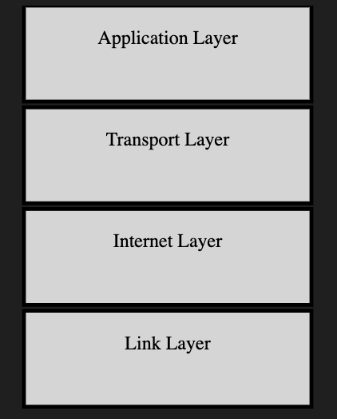
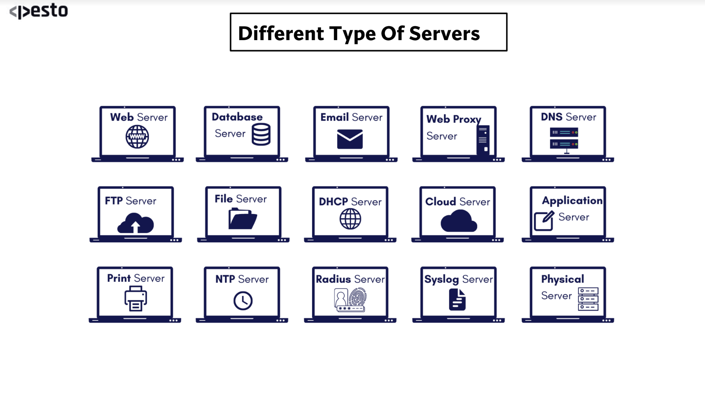
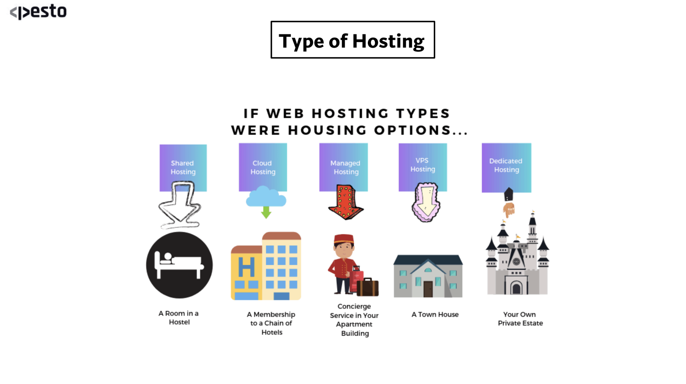

**What is a protocol stack, and how is it used in web development?**

A protocol stack is a specific set of rules that defines what kind of protocols need to be followed
to execute a perticular network request on the internet. 

In the context of web development, refers to a set of communication protocols and standards organized
in a layered structure. It is used to facilitate data exchange and communication between different
components of a web application or between a client and a server. 
In web development, the primary protocol stack used is the TCP/IP (Transmission Control Protocol/
Internet Protocol) stack, which underlies the entire Internet. It includes protocols like HTTP 
(Hypertext Transfer Protocol), DNS (Domain Name System), and others that enable the functioning of
 the World Wide Web

 TCP/IP Stack Layers:

    Application Layer - This is where high-level protocols reside, like HTTP, FTP, and SMTP. In the
    context of web development, HTTP is paramount as it governs web data exchange.

    Transport Layer - TCP and UDP are the main protocols here. TCP ensures data arrives correctly and
    in order, while UDP is faster but doesn't guarantee delivery or order.

    Internet Layer - This contains the IP protocol, which is responsible for routing packets of data
    across networks.

    Link Layer - This deals with protocols that operate on a network's link connections, like
    Ethernet.

**What are the different types of web servers, and how do they differ in terms of functionality and performance?**

Web servers are software or hardware systems that serve web content to clients, such as web browsers.
There are different types of web servers, for example:

Web Server: Hosts web pages and responds to requests from browsers. It provides static content to users, like HTML pages, images, and multimedia files.

Database Server: Primarily dedicated to providing database services. It stores, retrieves, and manages data in databases.

Email Server: Manages, sends, and receives emails. It acts as a post office, sorting and delivering emails to individual mailboxes.

Web Proxy Server: Acts as an intermediary between a user's device and the internet. It is used to cache content and filter requests.

DNS Server: Stands for "Domain Name System." It translates domain names into IP addresses, directing internet traffic to the correct server.

FTP Server: Short for "File Transfer Protocol." It facilitates the transfer of files between devices over a network.

File Server: Used for storing and managing digital files. It can be accessed by users on a network.

DHCP Server: Stands for "Dynamic Host Configuration Protocol." It automatically assigns IP addresses to devices on a network.

Cloud Server: A virtual server running in a cloud computing environment. It can be easily scaled up or down based on demand.

Application Server: Supports the running of application software. It provides both facilities to create web applications and a server environment to run them.

Print Server: Manages printers and print requests within an organization. It queues print jobs and sends them to respective printers.

NTP Server: Short for "Network Time Protocol." It synchronizes the clocks of computers over a network.

Radius Server: Used in wireless networks. It handles authentication, authorization, and accounting.

Syslog Server: Collects and stores log messages from different devices, offering centralized logging and reporting.

Physical Server: A tangible machine that provides resources and services. It's the actual hardware that runs software applications.
    
**What is web hosting, and what are the different types of hosting services available for websites?**

Web hosting is a service provided by entities that offer servers to host an application on the web.
Some of the ypes of hosting services availaible are as follows:

Shared Hosting :

Shared hosting is one of the most popular and cost-effective choices for small websites. As the name suggests, multiple websites share a single server and its resources, including bandwidth, disk space, and CPU.

Pros:

Economical and great for beginners.
Setup, maintenance, security, and updates are managed by the hosting provider.
Cons:

Limited resources.
Performance can be affected by other websites hosted on the same server.
Less control over server settings.

Cloud Hosting :

Cloud hosting is a more modern hosting solution that utilizes multiple different servers in different locations, effectively treating them as one. This ensures high availability and reduces the chances of downtime.

Pros:

Scalability: Easily upscale or downscale resources based on traffic.
Redundancy due to distributed nature ensures high uptime.
Pay for the resources you use.
Cons:

Can be more expensive than traditional hosting.
Might require a bit more technical knowledge to manage.

Managed Hosting : 

In managed hosting, the hosting provider takes care of all the technical aspects of your server. This includes security, backups, updates, and server uptime.

Pros:

High performance as servers are optimized for the specific platform (like WordPress).
Expert support and advice.
Focus on your website content and design without worrying about technicalities.
Cons:

More expensive than shared hosting.
Less control over server settings.

VPS Hosting :

A VPS is a virtualized server, acting as a dedicated server within a larger server. It's a middle-ground between shared and dedicated hosting.

Pros:

More control with root access to the server.
Guaranteed resources as they aren’t shared with other websites.
Customizable server environment.
Cons:

More expensive than shared hosting.
Requires more technical knowledge to set up and manage.

Dedicated Hosting :

As the pinnacle of hosting types, dedicated hosting provides an entire server dedicated to your website. It's ideal for large businesses or high-traffic websites.

Pros:

Full control over the server.
Maximum performance and speed.
Enhanced security features.
Cons:

Most expensive hosting type.
Requires technical expertise to manage.

**What is scaling, and why is it important for web applications? How does scaling differ for vertical and horizontal scaling?**

Scaling in web applications refers to the process of increasing the system's capacity to handle more
users, traffic, or data. It's essential to ensure that a web application remains responsive and
available, especially during traffic spikes. Scaling can be achieved through vertical scaling
(scaling up) and horizontal scaling (scaling out):

Vertical Scaling (Scaling Up)

Advantages:
Simplicity: Easier to implement as it involves just upgrading existing server resources.
No Data Partitioning: Data remains centralized, so there's no need to partition or distribute it across servers.
Limitations:
Physical Limits: There's a maximum limit to how much you can upgrade a single server.
Downtime: Upgrading server resources may require downtime.
Costly Upgrades: High-end server components can be expensive.
Horizontal Scaling (Scaling Out)

Advantages:
Flexibility: Can add or remove servers based on the demand.
High Availability: Even if one server goes down, others remain operational.
Distributed Load: Can handle large amounts of traffic by distributing it across multiple servers.
Limitations:
Complexity: More complex to set up and maintain. Requires load balancing, and possibly data partitioning and synchronization.
Data Consistency: Ensuring data consistency across servers can be challenging, especially in real-time applications.
Horizontal Scaling: Involves adding more server instances to distribute the load. It's suitable for
applications with high scalability needs and is often used in cloud-based environments. Load
balancers are commonly employed to distribute traffic across these instances.

Horizontal Scaling (Scaling Out)

Advantages:
Flexibility: Can add or remove servers based on the demand.
High Availability: Even if one server goes down, others remain operational.
Distributed Load: Can handle large amounts of traffic by distributing it across multiple servers.
Limitations:
Complexity: More complex to set up and maintain. Requires load balancing, and possibly data partitioning and synchronization.
Data Consistency: Ensuring data consistency across servers can be challenging, especially in real-time applications.

Load Balancers in Horizontal Scaling

Load balancers play a crucial role in horizontal scaling. They distribute incoming network traffic across multiple servers, ensuring no single server is overwhelmed with too much traffic. There are different strategies employed by load balancers:

Round Robin: Requests are distributed sequentially to each server.
Least Connections: Directs traffic to the server with the fewest active connections.
IP Hash: Determines the server to send a request based on the IP address of the client.
Other Considerations in Scaling

State Management: As you scale, managing user sessions and states becomes challenging. Solutions like sticky sessions or centralized session stores can help.

Data Storage Scaling: As data grows, databases may become bottlenecks. Solutions include database replication, sharding, or using NoSQL databases designed for horizontal scaling.

Microservices Architecture: Decomposing an application into smaller, independent services can make horizontal scaling more manageable. Each service can be scaled independently based on its demand.

**What is SEO (Search Engine Optimization), and how can web developers optimize their websites for better search engine rankings?**

SEO is the practice of optimizing a website to improve its visibility and ranking in search engine
results. Web developers can optimize their websites for better search engine rankings through various
techniques:

    1. Keyword Research: Identifying relevant keywords and integrating them into content.
    2. On-Page SEO: Optimizing meta tags, headings, and content for keywords.
    3. Quality Content: Creating high-quality, relevant, and engaging content.
    4. Mobile Optimization: Ensuring the website is mobile-friendly.
    5. Site Speed: Improving loading times for better user experience and search ranking.
    6. Backlinks: Building quality backlinks from reputable websites.
    7. Technical SEO: Optimizing site structure, improving crawlability, and fixing issues like broken links.
